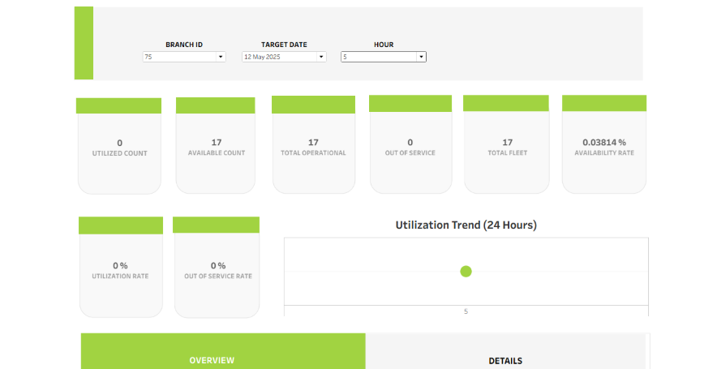

# Fleet Management Dashboard

This project focuses on monitoring and analyzing fleet performance using Tableau.  
The dashboard provides real-time insights into **vehicle utilization, availability, and operational efficiency** to help optimize fleet operations.

---

## 📊 KPIs Defined

### 1. Utilized Count  
Number of fleet vehicles currently in use (actively assigned/operated).

### 2. Available Count  
Number of vehicles that are operational and ready for use but not currently assigned.

### 3. Total Operational  
Total number of vehicles in working condition (includes both utilized and available).

### 4. Out of Service  
Number of vehicles that are unavailable due to maintenance, breakdown, or other operational issues.

### 5. Total Fleet  
Total number of vehicles in the fleet (sum of utilized, available, and out-of-service).

### 6. Availability Rate (%)  
Percentage of vehicles available for use:  
\[
\text{Availability Rate} = \frac{\text{Available Vehicles}}{\text{Total Fleet}} \times 100
\]

### 7. Utilization Rate (%)  
Percentage of vehicles currently in use:  
\[
\text{Utilization Rate} = \frac{\text{Utilized Vehicles}}{\text{Total Fleet}} \times 100
\]

### 8. Out of Service Rate (%)  
Percentage of vehicles out of service:  
\[
\text{Out of Service Rate} = \frac{\text{Out of Service Vehicles}}{\text{Total Fleet}} \times 100
\]

### 9. Utilization Trend (24 Hours)  
A time-series visualization showing changes in fleet utilization over a 24-hour period, highlighting peak and off-peak usage.

---

## Dashboard 

